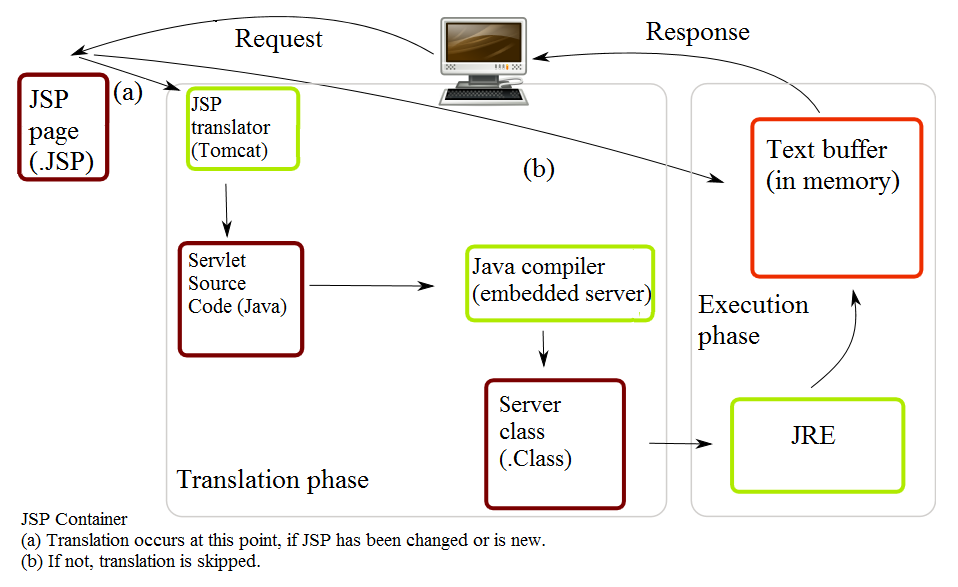

## Overview
The WAR Binary Processing project is a frontend plugin built on top of [Atlas](http://www.ensoftcorp.com/atlas/) to add support for processing [Java WAR](https://en.wikipedia.org/wiki/WAR_%28file_format%29) binaries for use in program analysis.

<blockquote cite="https://en.wikipedia.org/wiki/WAR_(file_format)">In software engineering, a WAR file (or Web application ARchive) is a JAR file used to distribute a collection of JavaServer Pages, Java Servlets, Java classes, XML files, tag libraries, static web pages (HTML and related files) and other resources that together constitute a web application.</blockquote>

Source: [https://en.wikipedia.org/wiki/WAR_(file_format)](https://en.wikipedia.org/wiki/WAR_(file_format))

Java Server Pages (JSPs) are an abstraction of Java Servlets.  A Servlet is a class that implements the Java Servlet API.  The Java Servlet API is a protocol that follows the request<->response programming model.  Servlets are not limited to any particular protocol but usually HTTP is used and while Servlets typically generate HTML or XML content they are not limited to any particular data format.

Looking at the figure below we can see that a client (represented as the computer at the top center) makes a request (most likely an HTTP request) to a .JSP page (Example: `http://www.example.com/test.jsp`). Once the request is received the JSP translator (such as a Tomcat server) translates the JSP page into a Java Servlet that is then compiled to Java byte code and execute in the Java Virtual Machine on the server. The result of executing the compiled Servlet is then returned as a response (most likely via a HTTP response) to the client machine.

## Features

The aim of this project is to provide an Atlas for Jimple frontend for processing Java WAR binaries. The project features are listed below.

- Import Wizard for processing Java WARs
- Extensible support for multiple JSP translator platforms
- Tested pre-compilation support for Tomcat 6, 7, and 8

The high-level process that this plugin performs is the following:

1. Unpack the WAR file and dump contents in an empty Eclipse Java project
2. Add all the JAR files found in the <code><project>/WEB-INF</code> directory to the classpath
3. Run ANT tasks to translate JSP pages to Class files and output to `<project>/WEB-INF/classes/*`
4. JAR generated Class files into `<project>/WEB-INF/classes.jar`
5. Convert classes.jar to Jimple and output to `<project>/WEB-INF/jimple/*`

## Getting Started

Ready to get started?

1. First [install](./install.html) the WAR Binary Processing plugin
2. Then check out the provided <a href="./tutorials.html">tutorial</a> to jump start your analysis

## Source Code

Need additional resources?  Checkout the [Javadocs](./javadoc/index.html) or grab a copy of the [source](https://github.com/benjholla/AtlasWBP).